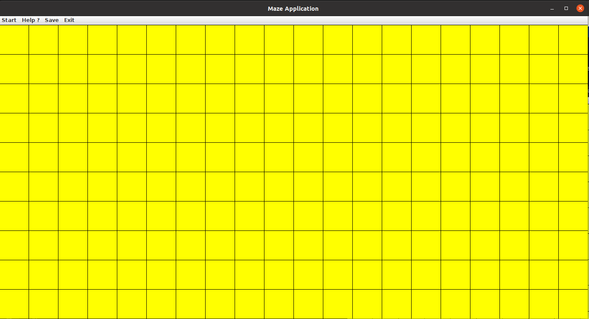
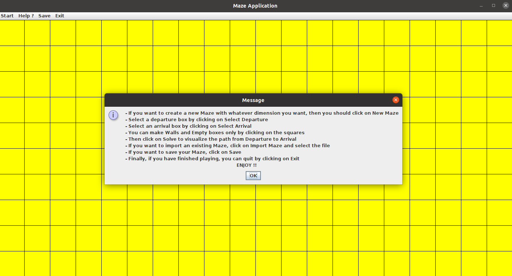

# Maze
## Interface graphique
Mon interface graphique de ce projet Java n'est pas limité juste aux méthodes qu'on a défini dans la classe Maze, mais elle nous permet de réaliser d'autres tâches, de façon à ce que n'importe quelle personne peut s'amuser à créer des labyrinthes et jouer sans avoir aucune connaissance préalable du côté programme.

## Commençons le jeu
### 1- Lancement du jeu:
Tout d'abord, lorsqu'on lance notre classe Main, il y a affichage à l'écran d'un labyrinthe vide (que des Empty cases ) de taille 10x10.
Les cases vides on une couleur Jaune.

### 2- Quoi faire?
- On peut choisir des Walls en cliquant tout simplement sur une case vide, et choisir une case vide en cliquant sur une case Wall.
Cela est illustré comme ceci : 

 Et ainsi de suite.
 - On peut choisir une case de départ (en BLEU) et une case d'arrivée (en ROSE) en cliquant sur le menu START, ensuite faire SELECT DEPARTURE et cliquer sur une case qu'on veut mettre comme case départ,et de même pour SELECT ARRIVAL.
 
 - Ensuite, pour trouver notre chemin, il suffit de cliquer sur Solve qui se trouve dans le menu Start.
 Et le chemin se colorie en vert.

 

 ### 3- Faire ce qu'on veut :
 Pour créer notre propre labyrinthe avec nos propres dimensions, on peut cliquer sur le menu Start, et ensuite New Maze. Puis on sélectionne la longueur et la hauteur du labyrinthe,(Attention les valeurs doivent être des entiers bien sûr). Et un labyrinthe vide se crée avec nos dimensions qu'on veut.

 - On sélectionne la largeur :

 

 - En suite on sélectionne la hauteur :

 

 - Et notre labyrinthe est créé :

 
 - Et on refait les mêmes démarches.

 ### 4- Importer un labyrinthe existant :

 - On peut bien sûr importer un labyrinthe existant à l'aide de : Start --> Import Maze 

 

 - Ici par exemple, j'importe le texte Demo 2

 

 - Et on rejoue.

 ### 5- Sauvegarder le labyrinthe:

 - Pour sauvegarder notre labyrinthe, on clique sur Save ensuite Save Maze, et on entre le nom de notre fichier texte où l'on veut enregistrer notre labyrinthe.

 

 ### 6- Quitter :
 - Pour quitter le jeu, on click sur Exit, ensuite Quit Game.

 ### 7- Instructions :

 Tout ces instructions se trouvent dans le menu Help --> Instructions .

  

 # ENJOY